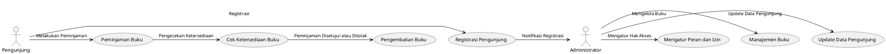

Berikut adalah BRD dalam format Markdown berdasarkan kode dan kebutuhan yang telah Anda berikan:

---

# **Business Requirements Document (BRD)**  
**Sistem Manajemen Perpustakaan**

---

## **1. Introduction**

### 1.1 Purpose of Document
Dokumen ini merupakan *Business Requirement Document* (BRD) yang bertujuan untuk menjelaskan kebutuhan dan alur kerja pada proyek pengembangan Sistem Manajemen Perpustakaan. Sistem ini dirancang untuk mendukung manajemen data buku, peminjaman, dan pengelolaan pengunjung perpustakaan, serta mengatur hak akses berbasis peran.

### 1.2 Project Scope
Sistem ini mencakup modul-modul berikut:
- **Manajemen Pengunjung**: Registrasi dan pengelolaan data pengunjung perpustakaan.
- **Manajemen Buku**: Menyimpan dan memperbarui data buku, termasuk ketersediaan.
- **Peminjaman Buku**: Mengelola peminjaman buku oleh pengunjung, mencatat tanggal pinjam dan tanggal kembali.
- **Manajemen Hak Akses**: Mengatur akses berbasis peran menggunakan *Spatie Permissions*.

---

## **2. System Requirement**

### 2.1 Business Flow

1. **Registrasi Pengunjung**:
   - Pengunjung melakukan registrasi.
   - Administrator menerima notifikasi registrasi dan memverifikasi data pengunjung.
   - Jika diterima, pengunjung dapat melanjutkan proses peminjaman. Jika ditolak, pengunjung menerima notifikasi penolakan.

2. **Peminjaman Buku**:
   - Pengunjung yang terdaftar dapat melihat daftar buku yang tersedia.
   - Setelah memilih buku, pengunjung melakukan peminjaman, dan sistem memverifikasi ketersediaan buku.
   - Jika tersedia, peminjaman disetujui dan tanggal pengembalian dicatat. Jika tidak tersedia, proses peminjaman dihentikan.

3. **Manajemen Buku**:
   - Administrator dapat menambah, memperbarui, atau menghapus data buku serta mengatur status ketersediaan.

---

## **3. Business Requirement**

### 3.1 Functional Requirement

| No | Kebutuhan Modul/Doctype                              | Status             |
|----|------------------------------------------------------|--------------------|
| 1  | **Registrasi Pengunjung** - Insert - View - Update - Delete | Modul/doctype baru |
| 2  | **Manajemen Buku** - Menambah Buku - Menghapus Buku - Update Data Buku | Modul/doctype baru |
| 3  | **Peminjaman Buku** - Cek Ketersediaan Buku - Menambah Data Peminjaman - Update Status Buku | Modul/doctype baru |
| 4  | **Hak Akses Berbasis Peran** - Mengatur Peran - Mengatur Izin Akses | Modul/doctype baru |

---

## **4. Approval**

| No. | Modul/Doctype             | Tingkat Approval                                               |
|-----|----------------------------|----------------------------------------------------------------|
| 1   | **Registrasi Pengunjung**  | Administrator melakukan verifikasi dan persetujuan registrasi pengunjung baru. |
| 2   | **Peminjaman Buku**        | Administrator memverifikasi ketersediaan buku dan menyetujui peminjaman jika tersedia. |
| 3   | **Manajemen Buku**         | Administrator memiliki akses penuh untuk memperbarui status dan data buku. |

---

## **5. Timeline**

| Phase               | Deliverable                             |
|---------------------|-----------------------------------------|
| Analysis & Design   | *Business Requirement Document* (BRD)   |
| Development         | Modul Sistem                           |
| UAT                 | *User Acceptance Testing Document*     |
| Training            | *User Manual*                          |
| Data Migration      | *Checklist Document*                   |
| Go Live             | *BAST Completion*                      |

---

## **6. Use Case Diagram**

Berikut adalah diagram *use case* yang menggambarkan alur sistem:

--- 

Dokumen ini dapat digunakan sebagai panduan untuk pengembangan sistem manajemen perpustakaan.